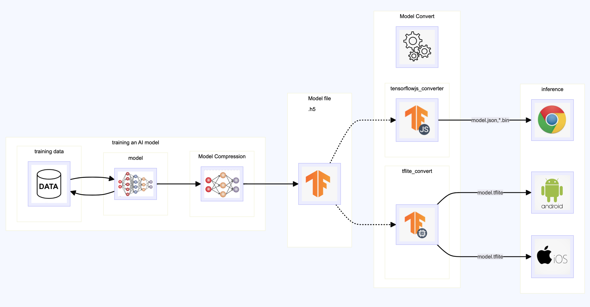

# tf_dnn_edge

- 如何利用邊緣裝置 (例如手機或是 PC 瀏覽器) 來執行模型的推理。
- 假設模型都訓練好了，推理也正常，這裡使用 tensorflow keras 的架構。

## training data / training an AI model

- 人工智慧系統就像一個複雜的計算機程式,它能夠接收大量訓練資料,就如同輸入無數的例題和答案一般。透過機器學習演算法,這個程式能自動從訓練資料中發現潛在的規則和模式。

- 假設我們有一個待解決的問題,例如你不知道每種水果的單價,但卻有過去購買不同組合數量時的總價資料。有了這些歷史資料,我們就希望能得到一種工具,只要輸入各種水果的數量,就能推理出應付的總價錢。

- 訓練資料的形式是,每一筆記錄都包含當次購買的各種水果數量以及實際支付的總價錢。舉例來說,也許有一筆記錄是購買3個西瓜、2個蘋果和1顆葡萄,總價321元。假設我們收集了數以萬計的這種訓練數據。

- 人工智慧系統就是不斷學習理解這些訓練數據,並最終訓練出一個模型。這個模型的用途在於,未來只要輸入不同水果的購買數量,它就能推理出應支付的總價錢。

- 傳統做法是透過某些數值方法,試圖精確計算出每種水果的單價,以這個為基礎來計算總和價錢。但事實上, 單價本身並非我們最關心的, 我們真正在意的是能 推理出總價錢。我們需要先忘記單價這個概念。

- 由於這裡說的是邊緣計算。我們先假設這些人工智慧的訓練方式都已經完成，模型也訓練好了，也可以正常使用。

## Model Compression 

- 訓練出來的模型如果體積太大，需要壓縮才能在邊緣裝置做計算。

## Model Convert

- 將訓練好的模型轉為 tensorflow.js 可以讀取的格式。Edge 端的 瀏覽器例如 chrome 就能運行.
    - 轉出的檔案是: 一個 model.json 和一些 .bin 的檔案，[這裡](https://gitlab.com/jiechau/tf_dnn_edge/-/tree/main/tfjs?ref_type=heads)。
    - 將這些檔案交給前端開發人員

- 將訓練好的模型轉為 tensorflow lite 可以讀取的格式。Edge 端的 手機例如 andriod/ios 就能運行.
    - 轉出的檔案是: 一個 model.tflite，[這裡](https://gitlab.com/jiechau/tf_dnn_edge/-/tree/main/tflite?ref_type=heads)。
    - 將這些檔案交給 手機 開發人員

## inference

- Edge 端的瀏覽器
    - chrome 範例如 [index.html](https://jiechau.gitlab.io/tf_dnn_edge/index.html)，( [原始檔案](https://gitlab.com/jiechau/tf_dnn_edge/-/tree/main/public?ref_type=heads) )

- Edge 端的行動裝置
    - andriod 範例
    - ios 範例

